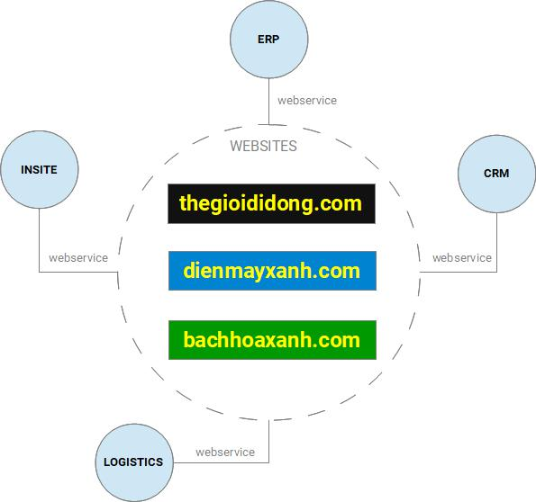

# Tổng quan toàn hệ thống

Trong các đồ án môn học ở trường, sẽ có lần các bạn tự tạo ra một website cho riêng mình. Các bạn tự xây dựng từ database cho đến backend \(kết nối và xử lý dữ liệu từ database\) và frontend \(giao diện và các kịch bản mà user sẽ có thể thực hiện trên website\). Trong thực tế, những hệ thống với quy mô doanh nghiệp như MWG lớn hơn nhiều so với những gì bạn nghĩ và làm được.


Trước khi đi tiếp, hãy tưởng tượng rằng bạn là chủ một cửa hàng kinh doanh: "_Tôi cần làm gì để  kinh doanh hiệu quả?_".


Không có gì bàn cãi khi rõ ràng chúng ta cần một website bán hàng, nhưng nếu chỉ có thế bạn sẽ không thể _kinh doanh hiệu quả_. Bạn cần phải quản lý được thông tin hàng hóa, kiểm soát nhập - xuất - tồn kho, lập các báo cáo về doanh số, báo cáo kế toán - tài chính... Bạn cần quản lý được thông tin khách hàng để biết được ai đã mua gì và chăm sóc thật tốt khách hàng của bạn. Bạn cần các giải pháp về giao hàng sao cho nhanh nhất nhưng tiết kiệm chi phí nhất. Và nếu doanh nghiệp của bạn có hơn 10 người bạn cũng cần một công cụ quản lý thông tin nhân sự, chấm công hay đơn giản là một blog nho nhỏ để họ chia sẻ với nhau những điều thú vị về công ty. Như vậy, để hoạt động hiệu quả thì song song với website bán hàng chúng ta cần có những hệ thống khác nữa để hỗ trợ vận hành doanh nghiệp.

Khi đã hình dung được câu chuyện trên, bạn sẽ bắt đầu cảm giác được tại sao MWG lại xây dựng mô hình hệ thống như sau:

Trong đó:

* **ERP**: Là hệ thống **Hoạch định tài nguyên doanh nghiệp**, nó cung cấp thông tin vể sản phẩm, tồn kho, giá cả và khuyến mãi cho các website; đồng thời là đích đến sau cùng của đơn hàng mà khách đã đặt trực tuyến.
* **CRM**: Là hệ thống **Quản lý quan hệ khách hàng**, nghĩa là tất cả thông tin liên lạc của khách hàng sẽ được lưu trữ và quản lý ở đây. Mặc khác, ngay sau khi đặt hàng thì đơn hàng của khách sẽ được tiếp nhận bởi hệ thống CRM để có những xử lý ban đầu trước khi chuyển đến ERP.
* **LOGISTICS**: Là hệ thống **Quản lý kho vận**, nó được xây dựng để phục vụ bài toán giao hàng đến cho khách nhanh nhất nhưng tiết kiệm chi phí nhất. Dễ gặp nhất, trong _giỏ hàng_ của các website luôn có thông tin về _thời gian khách có thể nhận hàng_, nó là kết quả tính toán của hàng loạt công thức phức tạp được xử lý bởi hệ thống này.
* **INSITE**: Là hệ thống Quản trị vận hành nội bộ, hiểu đơn giản đây là website nội bộ của công ty mà chỉ nhân viên MWG mới truy cập được. Trong một số trường hợp các website cần lấy thông tin từ hệ thống này để phục vụ cho vài nhu cầu kinh doanh đặc thù.


Cần hiểu rằng, mỗi một hệ thống trên đều có kích cở \(scale\) không hề nhỏ, cho nên trong thực tế chúng không thuộc về hệ thống website mà chỉ kết nối đến các website để cung cấp hoặc nhận lấy những thông tin cần thiết thông qua công nghệ Webservice.

_Chúng ta sẽ làm rõ hơn về những loại webservice mà MWG sử dụng trong trang tiếp theo._


Tóm lại, bạn đã thấy được, để hệ thống website MWG có thể vận hành hiệu quả cần có quan hệ mật thiết đến những hệ thống khác nhau trong doanh nghiệp. Tương ứng với mỗi hệ thống là các bộ phận mà khi trở thành nhân viên chính thức bạn sẽ phải phối hợp cùng họ để hoàn tất công việc hiệu quả.

